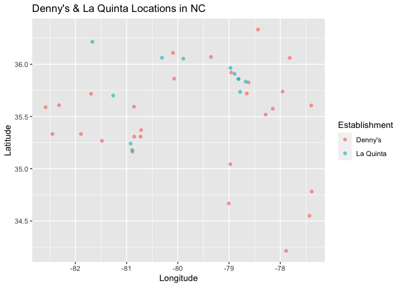
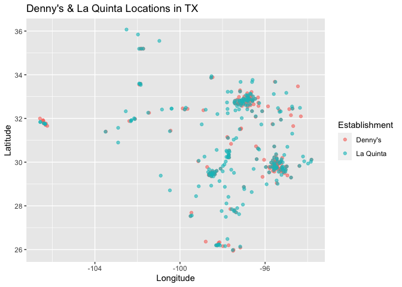

Lab 04 - La Quinta is Spanish for next to Denny’s, Pt. 1
================
Sophie Boyd
2-6-26

### Load packages and data

``` r
library(tidyverse) 
library(dsbox)
```

``` r
states <- read_csv("data/states.csv")
```

### Exercise 1

``` r
view(dennys)
nrow(dennys)
```

    ## [1] 1643

``` r
ncol(dennys)
```

    ## [1] 6

The Denny’s dataset contains 1643 observations of 6 variables. Each row
represents one Denny’s establishment. The variables are address, city,
state, zip code, longitude, and latitude.

### Exercise 2

``` r
view(laquinta)
nrow(laquinta)
```

    ## [1] 909

``` r
ncol(laquinta)
```

    ## [1] 6

The La Quinta dataset contains 909 observations of 6 variables. Each row
represents one La Quinta establishment. The variables are the same as
the Denny’s dataset: address, city, state, zip code, longitude, and
latitude.

### Exercise 3

The La Quinta website lists many locations outside of the US, including
in Canada, Mexico, China, New Zealand, Georgia, Turkiye, the UAE,
Colombia, and Ecuador.

The Denny’s website seems to only contain locations in the US.

### Exercise 4

One way to determine if locations in either dataset are outside of the
US would be to look at the values on the “state” variable. If the values
do not indicate a US state, this would confirm that the establishment is
located outside of the US.

### Exercise 5

``` r
dennys %>%
  filter(!(state %in% states$abbreviation))
```

    ## # A tibble: 0 × 6
    ## # ℹ 6 variables: address <chr>, city <chr>, state <chr>, zip <chr>,
    ## #   longitude <dbl>, latitude <dbl>

There do not appear to be any Denny’s locations outside of the US.

### Exercise 6

``` r
dennys <- dennys %>%
  mutate(country = "United States")
```

### Exercise 7

``` r
laquinta %>%
  filter(!(state %in% states$abbreviation))
```

    ## # A tibble: 14 × 6
    ##    address                                  city  state zip   longitude latitude
    ##    <chr>                                    <chr> <chr> <chr>     <dbl>    <dbl>
    ##  1 Carretera Panamericana Sur KM 12         "\nA… AG    20345    -102.     21.8 
    ##  2 Av. Tulum Mza. 14 S.M. 4 Lote 2          "\nC… QR    77500     -86.8    21.2 
    ##  3 Ejercito Nacional 8211                   "Col… CH    32528    -106.     31.7 
    ##  4 Blvd. Aeropuerto 4001                    "Par… NL    66600    -100.     25.8 
    ##  5 Carrera 38 # 26-13 Avenida las Palmas c… "\nM… ANT   0500…     -75.6     6.22
    ##  6 AV. PINO SUAREZ No. 1001                 "Col… NL    64000    -100.     25.7 
    ##  7 Av. Fidel Velazquez #3000 Col. Central   "\nM… NL    64190    -100.     25.7 
    ##  8 63 King Street East                      "\nO… ON    L1H1…     -78.9    43.9 
    ##  9 Calle Las Torres-1 Colonia Reforma       "\nP… VE    93210     -97.4    20.6 
    ## 10 Blvd. Audi N. 3 Ciudad Modelo            "\nS… PU    75010     -97.8    19.2 
    ## 11 Ave. Zeta del Cochero No 407             "Col… PU    72810     -98.2    19.0 
    ## 12 Av. Benito Juarez 1230 B (Carretera 57)… "\nS… SL    78399    -101.     22.1 
    ## 13 Blvd. Fuerza Armadas                     "con… FM    11101     -87.2    14.1 
    ## 14 8640 Alexandra Rd                        "\nR… BC    V6X1…    -123.     49.2

The La Quinta locations outside of the US are in: 1. Mexico 2. Mexico 3.
Mexico 4. Mexico 5. Colombia 6. Mexico 7. Mexico 8. Canada 9. Mexico 10.
Mexico 11. Mexico 12. Mexico 13. Honduras 14. Canada

### Exercise 8

``` r
laquinta <- laquinta %>%
  mutate(country = case_when(
    state %in% state.abb ~ "United States",
    state %in% c("ON", "BC") ~ "Canada",
    state == "ANT" ~ "Colombia",
    state %in% c("AG", "QR", "CH", "NL", "VE", "PU", "SL") ~ "Mexico",
    state == "FM" ~ "Honduras"
  ))
```

``` r
laquinta <- laquinta %>%
  filter(country == "United States")
```

### Exercise 9

``` r
dennys %>%
  count(state, sort = TRUE)
```

    ## # A tibble: 51 × 2
    ##    state     n
    ##    <chr> <int>
    ##  1 CA      403
    ##  2 TX      200
    ##  3 FL      140
    ##  4 AZ       83
    ##  5 IL       56
    ##  6 NY       56
    ##  7 WA       49
    ##  8 OH       44
    ##  9 MO       42
    ## 10 PA       40
    ## # ℹ 41 more rows

``` r
laquinta %>%
  count(state, sort = TRUE)
```

    ## # A tibble: 48 × 2
    ##    state     n
    ##    <chr> <int>
    ##  1 TX      237
    ##  2 FL       74
    ##  3 CA       56
    ##  4 GA       41
    ##  5 TN       30
    ##  6 OK       29
    ##  7 LA       28
    ##  8 CO       27
    ##  9 NM       19
    ## 10 NY       19
    ## # ℹ 38 more rows

Denny’s has the most locations in California and the fewest locations in
Delaware. La Quinta has the most locations in Texas and the fewest
locations in Maine. These results do not surprise me, considering that
California and Texas are both very large states and Maine and Delaware
(especially Delaware) are much smaller.

``` r
dennys %>%
  count(state) %>%
  inner_join(states, by = c("state" = "abbreviation"))
```

    ## # A tibble: 51 × 4
    ##    state     n name                     area
    ##    <chr> <int> <chr>                   <dbl>
    ##  1 AK        3 Alaska               665384. 
    ##  2 AL        7 Alabama               52420. 
    ##  3 AR        9 Arkansas              53179. 
    ##  4 AZ       83 Arizona              113990. 
    ##  5 CA      403 California           163695. 
    ##  6 CO       29 Colorado             104094. 
    ##  7 CT       12 Connecticut            5543. 
    ##  8 DC        2 District of Columbia     68.3
    ##  9 DE        1 Delaware               2489. 
    ## 10 FL      140 Florida               65758. 
    ## # ℹ 41 more rows

### Exercise 10

``` r
dennys <- dennys %>%
  mutate(establishment = "Denny's")
laquinta <- laquinta %>%
  mutate(establishment = "La Quinta")
```

``` r
dn_lq <- bind_rows(dennys, laquinta)
```

``` r
ggplot(dn_lq, mapping = aes(
  x = longitude,
  y = latitude,
  color = establishment
)) +
  geom_point()
```

<!-- -->

### Exercise 11

``` r
dn_lq_NC <- dn_lq %>%
  filter(state == "NC")
```

``` r
ggplot(dn_lq_NC, mapping = aes(
  x = longitude,
  y = latitude,
  color = establishment
)) +
  geom_point(alpha = .6) +
  labs(x = "Longitude",
       y = "Latitude",
       title = "Denny's & La Quinta Locations in NC",
       color = "Establishment")
```

<!-- -->

Mitch Hedberg’s joke seems to be somewhat supported in the North
Carolina plot. With some exceptions, most of the La Quinta
establishments are located relatively close to one or more Denny’s
establishments.

### Exercise 12

``` r
dn_lq_TX <- dn_lq %>%
  filter(state == "TX")
```

``` r
ggplot(dn_lq_TX, mapping = aes(
  x = longitude,
  y = latitude,
  color = establishment
)) +
  geom_point(alpha = .6) +
  labs(x = "Longitude",
       y = "Latitude",
       title = "Denny's & La Quinta Locations in TX",
       color = "Establishment")
```

<!-- -->

While there are clusters of many La Quinta and Denny’s establishments
located close together, overall, the joke does not hold up on the Texas
map because there are many La Quinta locations with no Denny’s locations
nearby.
